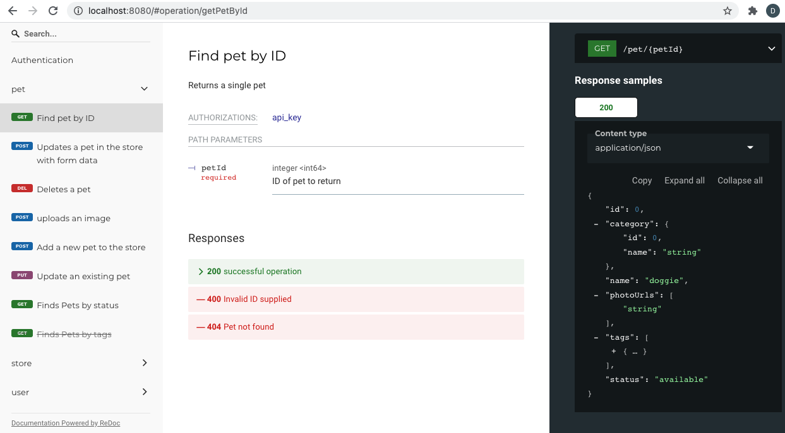
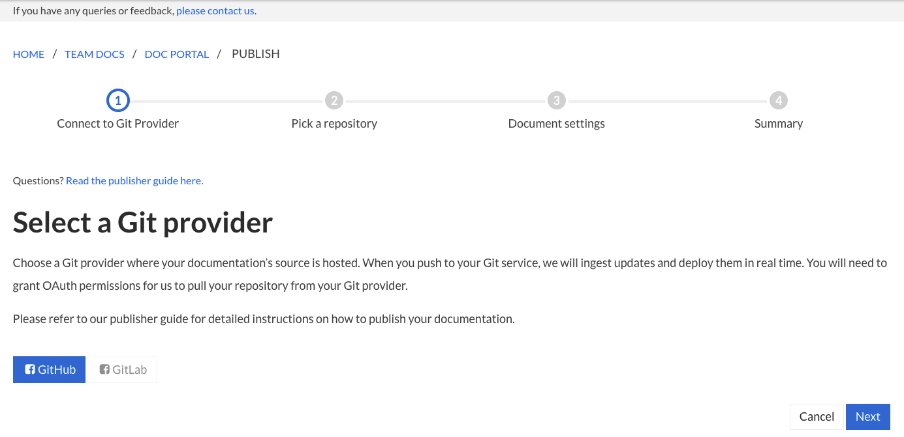

# Overview
<!-- todo: update this diagram -->


## Prerequisites

The developer documentation portal syncs up your documentation repository containing Markdown or OpenAPI(Swagger) files and hosts them as documentation pages.

You will need:

1. A [TechPass](https://www.techpass.gov.sg) account to log in and host your documentation.
2. A free [github.com](https://github.com) account to host your documentation's git repository.
3. To have been assigned the role of a publisher on Documentation Portal.
4. To have the **Product** for the documentation which you are writing for, already created.
5. To have been added as a member in said 'Product'


?> Points 3 - 5 would require you to reach out to the Developer's Portal Team

?> **Products** are government digital solutions such as TechPass, SHIP Hats, NDI etc. You will be able to choose which **Product** you will be writing your documentation for.

If your documentation is in Markdown, you will use [Docsify](https://docsify.js.org) to write and structure it on your development machine before pushing it to your GitHub repository.

If your documentation is in OpenAPI/Swagger, i.e. you are writing API documentation, you will use [ReDoc](https://github.com/Redocly/redoc) to view it on your development machine before pushing your `swagger.json` file to your GitHub repository.

## Overview of steps
<div style="text-align:center">
   
</div>

1. Write and preview your documentation on your machine with tools such as [Docsify](/get-started?id=create-and-preview-markdown) for Markdown, and [ReDoc](/get-started?id=preview-oas) for OAS
2. Create a GitHub repository and push your documentation to it
3. Log in to the developer documentation portal with your TechPass account
4. Go through the guided publishing flow when you access **Publish documentation** in your product's page:

## Quickstart

The two types of documentation that you can publish are:
1. Markdown 
2. Open API Specification / Swagger

The following examples show you how to get started with the creation of such docs, and also how to serve them on your local machines so that you can have a preview of how they would look like when published.

### 1a. Markdown
#### Create and Preview Markdown

The easiest way to get started with **Docsify** is through its [command line tool](https://docsify.js.org/#/quickstart).

1. You will need to have Node.js and NPM installed on your machine. Use the [official installer](https://nodejs.org/en/) or the [nvm tool](https://github.com/nvm-sh/nvm).

2. Create a Git repository to hold your documentation.

   ```bash
   mkdir my-docs
   cd my-docs
   git init
   ```

3. Use the [Docsify CLI](https://docsify.js.org/#/quickstart) to generate a documentation site. This creates the README.md and index.html files within your working directory.

   ```bash
   # Install Docsify CLI
   npm install -g docsify-cli
   # Creates an index.html and README.md within your working directory
   docsify init .
   ```

4. Start up a live-reloading server for your documentation. Open a browser and view it at http://localhost:3000.

   ```bash
   # View your documentation at http://localhost:3000
   docsify serve .
   ```

5. Commit your markdown files

   ```bash
   git add --all
   git commit -m "Initial commit"
   ```

### 1b. OpenAPI Spec


From the [official OpenAPI specification site](https://swagger.io/specification):

> The OpenAPI Specification (OAS) defines a standard, language-agnostic interface to RESTful APIs which allows both humans and computers to discover and understand the capabilities of the service without access to source code, documentation, or through network traffic inspection.
>
> An OpenAPI document (or set of documents) defines or describes an API. An OpenAPI definition uses and conforms to the OpenAPI Specification.

You can defined an OpenAPI or Swagger document in `yaml` or `json` and publish that on the developer documentation portal. It would be rendered as a human-readable page using the [ReDoc](https://github.com/Redocly/redoc) engine.


**<small>Note: This file must be named `swagger.json`, `swagger.yml` or `swagger.yaml`!</small>**

#### Preview OAS
You can use the [redoc CLI](https://github.com/Redocly/redoc/tree/master/cli) to preview how your API documentation would look like. You will need to have Node.js and NPM installed on your machine. Use the [official installer](https://nodejs.org/en/) or the [nvm tool](https://github.com/nvm-sh/nvm).

```bash
npm i -g redoc-cli
redoc-cli serve swagger.yml
```

You can then navigate to http://localhost:8080 to preview your rendered API documentation:



### 2. Push to GitHub
After your Markdown or OAS documentation is prepared, push it to GitHub.

[Create a new github.com repository](https://github.com/new) (this can be either public or private) and follow
the instructions on GitHub to push your new repository to that project.

```bash
# Either SSH authentication
git remote add origin git@github.com/my-username/my-project.git
# Or HTTP
git remote add origin https://github.com/my-username/my-project.git

# Push to the master branch of your GitHub project
git push -u origin master
```
>For **Markdown Docs**, you should have at least a `README.md` file at the **root** of your project, which will serve as the home page for your documentation.

>For **OAS/Swagger Docs**, you should have at least a `swagger.json`, `swagger.yml` or `swagger.yaml` file at the **root** of your project, which will serve as the home page for your documentation.

### 3. Log in and access your Product space

<div style="text-align:center">
   
</div>

Log in to the developer documentation portal by clicking on `Log in with TechPass` on the navigation bar. Navigate to `Team Docs` to see a list of Products that you are a member of (Contact the Developer's Portal Team for creation of new Products, and addition of members to Products).

Select the Product of which you are intending to publish documentation for, then click on the "Publish documentation" button. 

### 4. Publish your documentation with the guided Publishing Wizard


The publishing wizard will guide you through the steps required to get your documentation published.
#### Step 1. Select a Git Provider



In this step, you select a git provider (only GitHub available for now, but more options coming soon!) and authorise your account to Documentation Portal with the necessary permissions to perform publishing.

If this is your first time publishing a document, and you have not authorised your GitHub account to us before, you will be prompted to do so when you click next.
#### Step 2. Select a Repository

<div style="text-align:center">
   
</div>

In this step, you select a repository from your GitHub account to link up to your to-be published documentation. Your personal repositories along with the repositories of any organisation/teams of which your GitHub account is an admin of, will be available for selection. You can toggle these options under the 'Account' dropdown selection.
#### Step 3. Enter Document Details

<div style="text-align:center">
   
</div>

In this step, you provide details regarding how you want your documentation to be categorised and displayed. Some example options are, the display name, description, git branch, visibility option (Public/Private) and more.
1. How you want your Doc to be named and described
2. Choose whether your Doc can be viewed by anyone (Public), or only for logged-in users who has a TechPass account (Private). Also specify if your Doc is a Markdown or OAS type.
3. Additional settings if Markdown type is selected. Refer to <a href="/#/docsify?id=manual-configuration" target="_blank">Docsify configuration</a>
4. Select a branch of your GitHub repository to publish from.
5. Additional access control settings for Private Documentation. Refer to <a href="/#/collaboration/teams-and-permissions?id=configuring-permissions-for-readers" target="_blank">Configuring permissions for readers</a>


#### Step 4. Summary
<div style="text-align:center">
   
</div>

This is the final step where you review your repository selection and inputs. Upon verifying that all configurations are in order, click on 'Publish Documentation' to have your documentation published!


Once published, your documentation will be hosted at docs.developer.gov.sg. All changes made to your GitHub repository would be automatically
synced to the documentation portal.

> When published, every push to your documentation repo will be automatically pulled and served by the documentation portal. You can also configure the branch that is published.